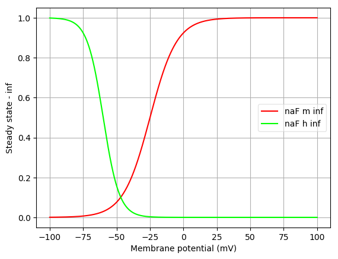
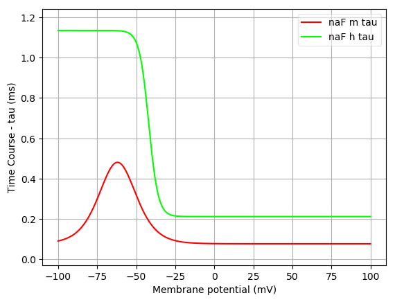
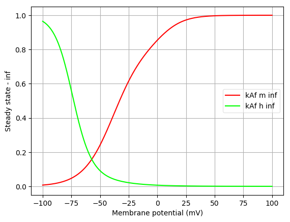
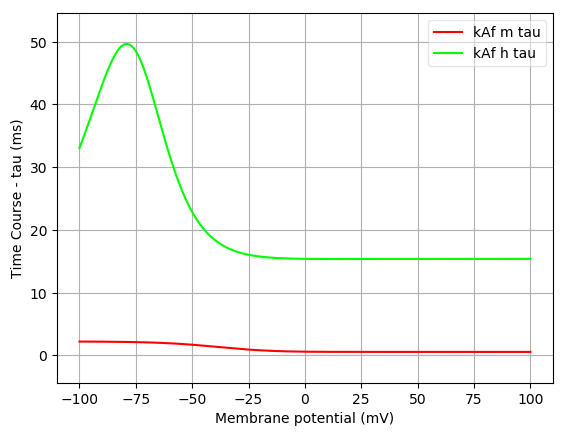
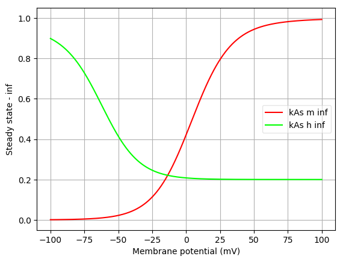
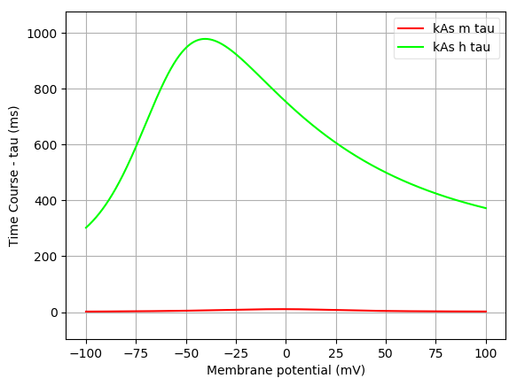
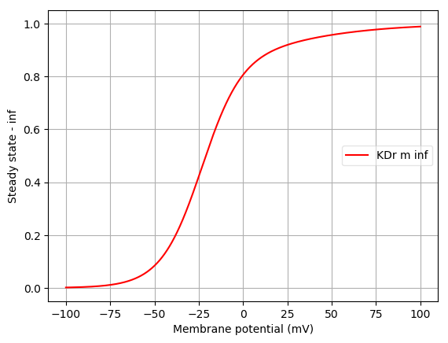
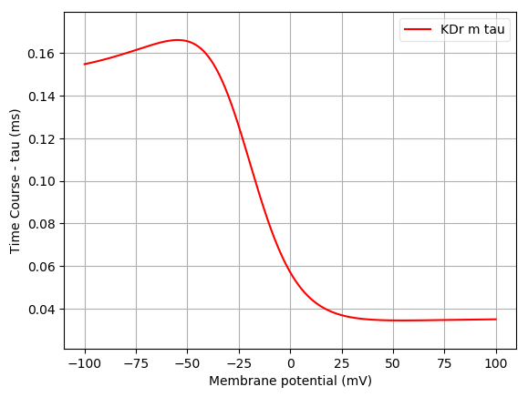
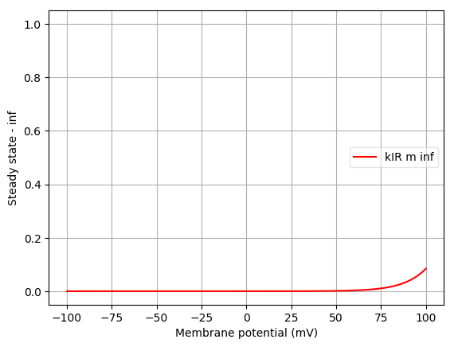
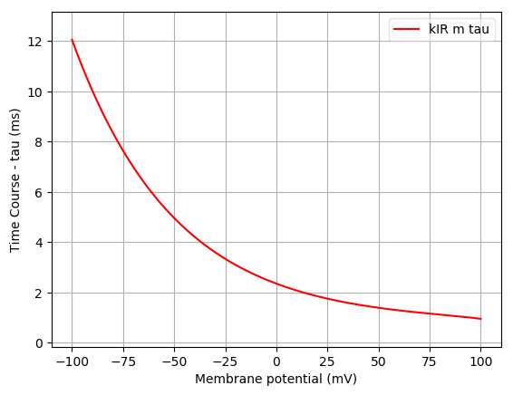

Channel information
===================
    

Channel information at: T = 32.0 degC, E_rev = 50.0 mV, [Ca2+] = 0.001 mM

<table>
    <tr>
<td width="120px">
            <b>naF</b> 
            <a href="../naFchanOgeqn.nml">naFchanOgeqn.nml</a> 
            <b>Ion: na</b> 
            <i>g = gmax * m3 * h </i> 
            ${channel.notes}
</td>
<td>

</td>
<td>

</td>
</tr>
    <tr>
<td width="120px">
            <b>kAf</b> 
            <a href="../kAf_chanREqfact.nml">kAf_chanREqfact.nml</a> 
            <b>Ion: k</b> 
            <i>g = gmax * m2 * h </i> 
            ${channel.notes}
</td>
<td>

</td>
<td>

</td>
</tr>
    <tr>
<td width="120px">
            <b>kAs</b> 
            <a href="../kAs_chanREqfact.nml">kAs_chanREqfact.nml</a> 
            <b>Ion: k</b> 
            <i>g = gmax * m2 * h </i> 
            ${channel.notes}
</td>
<td>

</td>
<td>

</td>
</tr>
    <tr>
<td width="120px">
            <b>KDr</b> 
            <a href="../KDr_chanQfact.nml">KDr_chanQfact.nml</a> 
            <b>Ion: k</b> 
            <i>g = gmax * m </i> 
            ${channel.notes}
</td>
<td>

</td>
<td>

</td>
</tr>
    <tr>
<td width="120px">
            <b>kIR</b> 
            <a href="../kIR_chanRE2.nml">kIR_chanRE2.nml</a> 
            <b>Ion: k</b> 
            <i>g = gmax * m </i> 
            ${channel.notes}
</td>
<td>

</td>
<td>

</td>
</tr>
</table>

